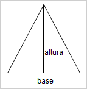
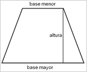

`Data Science` > [`Programacion con R`]
## Calculadora  

### OBJETIVO
- Entender la asignación de variables y operaciones basicas con R

#### REQUISITOS
1. Contar con R studio.
1. Usar la carpeta de trabajo `Sesion01/Ejemplo-01`

#### DESARROLLO

1. Calcular el área de un rectángulo 

Asignaremos las variables necesarias para realizar la operación en RStudio

	
	#Area de un Rectangulo
	base.rectangulo <- 10
	altura.rectangulo <- 2
	area.rectangulo <- base.rectangulo * altura.rectangulo
	area.rectangulo
	

2. Calcular el área de un triangulo

Asignaremos las variables necesarias para realizar la operación en RStudio

	
	#Area de un Triangulo
	base.triangulo <- 10
	altura.triangulo <- 2
	area.triangulo <- (base.triangulo * altura.triangulo) / 2
	area.triangulo
	
	
3. Calcular el área de un Circulo

Asignaremos las variables necesarias para realizar la operación en RStudio

	
	#Area de un Circulo
	radio <- 10
	pi <- 3.1416
	area.circulo<- (pi * radio^2)
	area.circulo
		
5. Calcular el área de un Trapecio

Asignaremos las variables necesarias para realizar la operación en RStudio

	
	#Area de un Trapecio
	baseMenor <- 15
	baseMayor <- 30
	altura.trapecio <- 10
	area.trapecio<- ((baseMayor+baseMenor)/2)*altura.trapecio
	area.trapecio
		

	