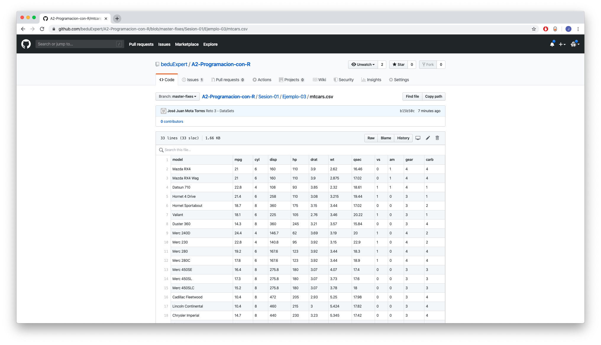
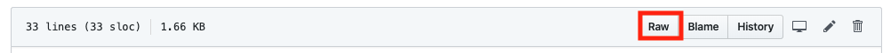
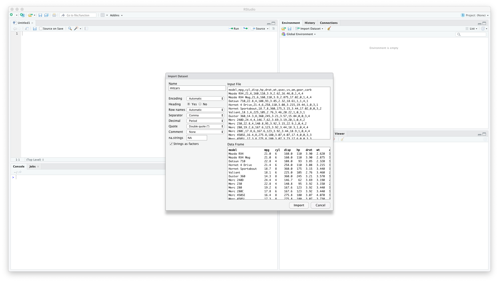
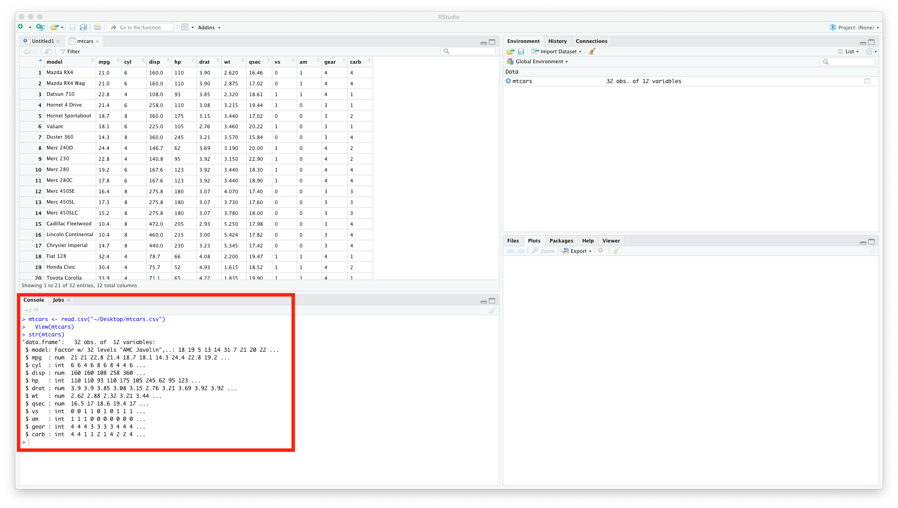

`Data Science` > [`Programacion con R`]
## Importación de dataset   

### OBJETIVO
- Entender la importación de un dataset con RStudio, a partir de un repositorio en GitHub

#### REQUISITOS
1. Contar con R studio.
1. Usar la carpeta de trabajo `Sesion01/Ejemplo-03`

#### DESARROLLO

1. Seleccionar el archivo `mtcars.csv` en el repositorio y nos desplegara la siguiente pantalla:
 
 

1. Seleccionaremos la opción **Raw**

 
 
1. Nos desplegara la siguiente pantalla
 
 
 
1. Realizaremos click derecho, elegiremos en la opción de **Guardar como...** 
 
 
 
1. Abriremos **RStudio** seleccionaremos la opción de **Import Dataset** y elegiremos la opción **From Text (base)...**
 
 
 
1. Buscaremos en nuestros directorios el archivo **mtcars.csv** , dejaremos las opciones por defecto e importaremos
 
 	
 
1. Desplegaremos la estructura de nuestro DataSet con el comando **str(mtcars)**
 
 	 
 
1. Desplegaremos la documentación de nuestro DataSet con el comando **?mtcars**
 
 	  	

	