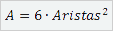
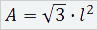

`Data Science` > [`Programacion con R`]
## Operaciones con R.  

### OBJETIVO
- Resolver operaciones por medio de R y RStudio

#### REQUISITOS
1. Contar con R studio
1. Usar la carpeta de trabajo `Sesion-01/Reto-01`

#### DESARROLLO

Ya estas listo para crear tu propia operacion en R?

Resuelve las siguientes formulas, para el calcular el área de diversas figuras:
 
1. Calcula el área de un Rombo
 
	
	
	

1. Calcula el área de un Cubo

	
	
	
	
1. Calcula el área de un Tetraedro

	
	
		
	
1.  Calcula el área de un cilindro 

	
	
	
	
	
[Solución](solucion)		

