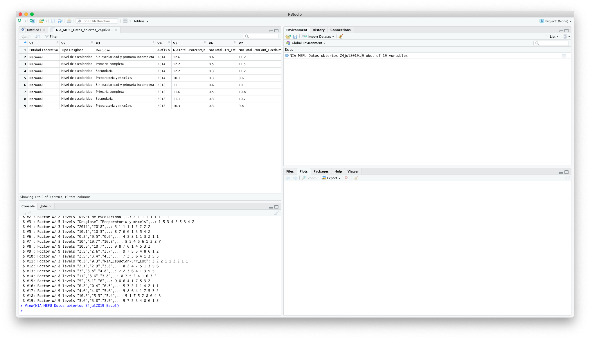

`Data Science` > [`Programacion con R`]
## Importación de dataset   

### OBJETIVO
- Importar un DataSet del sitio de **Datos Abiertos** en **Gob.mx**

#### REQUISITOS
1. Contar con R studio.
1. Usar la carpeta de trabajo `Sesion01/Reto-03`

#### DESARROLLO

1. Abrir el sitio de **datos.gob.mx** y descargar un DataSet en formato **CSV** 

	[datos.gob.mx](https://datos.gob.mx/busca/dataset?res_format=CSV&theme=Salud)
	
	

2. Realizar los pasos de **Importación** mostrados en `Sesion01/Ejemplo-03` y desplegar la estructura del DataSet

	

[Solución](Solucion)
	